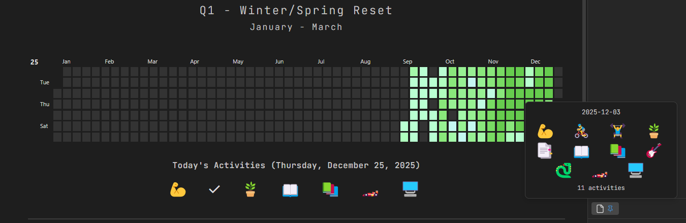
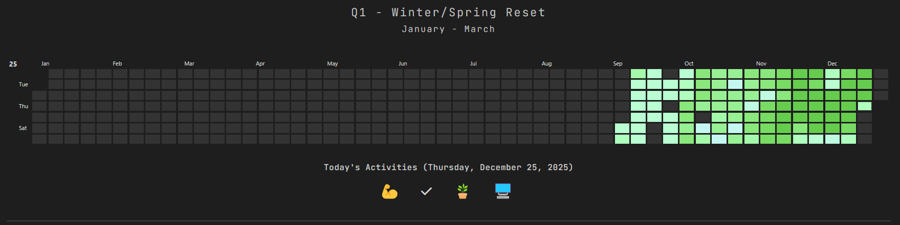
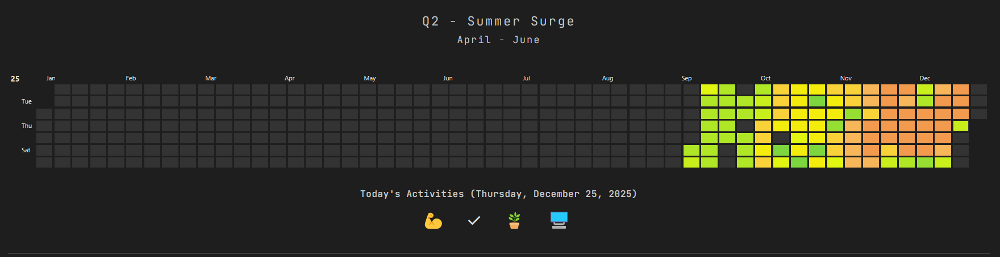
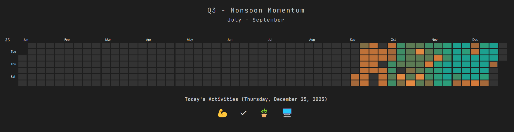
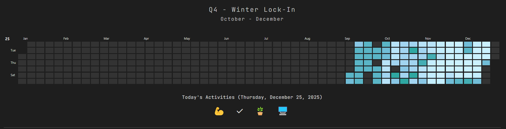

# Heatmap Calendar (with Seasons)

The heatmap calendar (with seasons) is a perfect homepage for your Obsidian setup. It tracks and displays your most productive and least productive days in a heatmap calendar. Some people might know it as a GitHub-style calendar.

> **Fun Fact:** The most productive colour for a season is the least productive colour for the next season. `"#66CC4E"` in the Winter/Spring Reset (Quarter 1) is the first colour in the Summer Surge quarter (Quarter 2).

It requires Dataview and [Heatmap Calendar](https://github.com/Richardsl/heatmap-calendar-obsidian) for it to work.

I have a lot of activities in a day, so my colour palette is huge (10 colours). You can shorten it as per your preferences or use cases.

In `const activities = []`, you can edit the following:

- `source` = folder where your daily notes are saved
- `field` = name of the property (must be a checkbox)
- `emoji` = emoji you want to display for the activities
- `colour` = can be anything (you can even reuse the colours)

You can change or modify the headers and other UI as per your liking.

---
  
## 🎄 Christmas Edition

The Christmas Edition adds a subtle snowfall effect to your Obsidian desktop. Snowflakes fall gently and disappear automatically after a short time.

You can control the intensity using const SNOWFLAKE_COUNT. For best performance and a distraction-free experience, keeping it **around 5 is recommended** (I personally use 1).

If the GIF feels laggy, you can check the higher-quality xmas25.mp4 in the preview folder.

---

## New Features

- **1.1.1**

You can now hover over a particular cell and it will display the icons/emojis of the activities you did on that particular day. It will also show you the amount of activities you did on that day. 

---

## Screenshots

---

## Versions

- 1.1.1 - 25 December, 2025
- 1.1.0 - November, 2025
